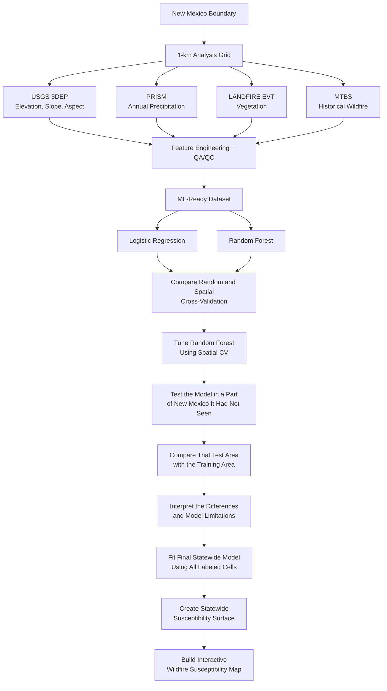

[Explore Interactive Map](/assets/maps/nm_wildfire_susceptibility_interactive.html){:
.btn .btn--primary}

[View Project on GitHub](https://github.com/fluidthinker/wildfire-susceptibility-ml){:
.btn .btn--inverse}

## Overview

I built a statewide geospatial machine-learning workflow to test whether patterns in topography, vegetation, and long-term precipitation associated with historical wildfire would still hold up when the model was applied to parts of New Mexico it had never seen before.

The project combines multiple raster and vector datasets into a common 1-km analysis grid, builds a supervised-learning dataset, compares Logistic Regression and Random Forest models, and evaluates how model performance changes under increasingly demanding forms of geographic validation.

The most important result was not the highest model score. It was finding that model performance changed substantially depending on whether the model was tested on locations similar to those it had already seen or on a geographically separate part of New Mexico. Random cross-validation made the model look very strong, while spatial validation and the final geographic test revealed much weaker transfer to new areas.

## Research Question

**Which relatively stable environmental characteristics distinguish areas of New Mexico that have historically experienced wildfire from areas that have not, and how well do those relationships hold up in areas the model has not seen before?**

The project focuses on **biophysical susceptibility** rather than short-term wildfire prediction. It does not attempt to predict the next ignition, current fire danger, or operational wildfire risk.

## Data and Technologies

### Data

| Dataset | Role in the project |
|---|---|
| **USGS 3DEP** | Elevation and derived terrain variables including slope and aspect |
| **PRISM Climate Normals** | Long-term annual precipitation |
| **LANDFIRE Existing Vegetation Type (EVT)** | Dominant vegetation class and within-cell dominance |
| **Monitoring Trends in Burn Severity (MTBS)** | Historical wildfire occurrence used to construct the target |
| **U.S. Census TIGER/Line** | New Mexico study-area boundary |

All datasets were transformed into a common **EPSG:5070, 1-km statewide analysis grid** so environmental characteristics and wildfire occurrence could be compared consistently.

### Technologies

**Geospatial and Data Engineering**

- Python
- GeoPandas
- Rasterio / Rioxarray
- Xarray / Dask
- Xarray-Spatial
- STAC / pystac-client
- Microsoft Planetary Computer
- DuckDB
- GeoParquet
- PyProj

**Machine Learning**

- scikit-learn
- Logistic Regression
- Random Forest
- Spatial cross-validation
- Hyperparameter tuning

**Visualization**

- Folium
- Matplotlib

## Workflow

The project was built as a reproducible pipeline from raw geospatial data to an interactive susceptibility map.

The final modeling dataset contained more than **313,000 labeled 1-km cells**. An additional set of target-ambiguous cells was excluded during model development but later received susceptibility estimates when the final statewide surface was created.

## Modeling and Validation

I compared two classification models:

- **Logistic Regression** as a simpler, interpretable baseline
- **Random Forest** to capture nonlinear relationships and interactions among environmental predictors

The larger methodological question was how the models should be evaluated.

### Random Cross-Validation

Random cross-validation mixes cells from across the state among training and validation folds.

The Random Forest performed very strongly under this approach:

- **ROC-AUC: 0.956**
- **Average Precision: 0.484**

### Spatial Cross-Validation

Because nearby locations can have similar environmental characteristics, I also grouped the state into approximately **50-km spatial blocks** and kept complete blocks together during validation.

Under spatial cross-validation, Random Forest performance decreased:

- **ROC-AUC: 0.901**
- **Average Precision: 0.230**

The drop suggested that random cross-validation provided a more optimistic picture of how well the model might perform in geographically separate areas.

## Key Finding: The Hardest Test Told a Different Story

The project also reserved a separate eastern band of spatial blocks as a geographic holdout. These cells were removed before model development and were not used during the original model fitting or cross-validation experiments.

When the baseline Random Forest was finally applied to this holdout:

- **ROC-AUC fell to 0.541**
- **Average Precision fell to 0.014**

That was a very different result from either random or spatial cross-validation.

A small follow-up Random Forest hyperparameter search was then performed using only the training data and the existing spatial cross-validation folds.

The tuned model produced only a modest improvement when evaluated again on the same geographic holdout:

- **Post-hoc tuned ROC-AUC: 0.570**
- **Post-hoc tuned Average Precision: 0.015**

Because the holdout result had already been observed before tuning, this second evaluation is treated as a **post-hoc learning exercise**, not as a new independent final test.

The important finding remained unchanged:

> **Strong cross-validation performance did not guarantee strong performance when the model was applied to a substantially different geographic area.**

## Why Was the Geographic Holdout Difficult?

Rather than immediately trying additional models, I compared the environmental characteristics of the training population with the eastern geographic holdout.

The holdout differed substantially from the training region.

| Characteristic | Training | Eastern holdout |
|---|---:|---:|
| Mean elevation | 1,846 m | 1,394 m |
| Mean slope | 6.39° | 2.17° |
| Mean annual precipitation | 350 mm | 400 mm |
| Historical wildfire prevalence | 2.61% | 1.36% |

Vegetation composition also differed strongly.

For example, one LANDFIRE EVT class represented approximately **52% of holdout cells but only 11% of training cells**.

Differences were even more pronounced among cells with historical wildfire occurrence:

- Mean elevation of positive cells: **2,355 m in training vs. 1,354 m in the holdout**
- Mean slope of positive cells: **16.0° in training vs. 2.8° in the holdout**

These diagnostics show that the holdout occupied a substantially different environmental setting from much of the training population.

They do **not** prove that those differences caused the performance decline, but they provide evidence that the model was being asked to transfer into environmental conditions that differed considerably from those under which many of its wildfire relationships were learned.

## Interactive Susceptibility Map

After model evaluation was complete, I refit the selected Random Forest using all available labeled cells and generated model-estimated susceptibility values for all **314,920 1-km grid cells** across New Mexico.

[Explore the Interactive Map](/assets/maps/nm_wildfire_susceptibility_interactive.html){:
.btn .btn--primary}

The map combines:

- the statewide susceptibility surface
- topographic and geographic context within New Mexico
- the independent eastern holdout boundary
- a lightweight raster display for responsive browser performance

The surrounding states are intentionally subdued so the visual focus remains on New Mexico.

### Important interpretation

The mapped values represent **model-estimated susceptibility based on the environmental relationships learned by the model**.

They should **not** be interpreted as:

- operational wildfire risk
- ignition probability
- probability of fire in a particular year
- a validated statewide hazard forecast

The weak geographic holdout performance is displayed as an explicit limitation of the model rather than hidden from the final presentation.

## Hyperparameter Tuning

A small Random Forest tuning exercise tested five predefined model configurations using the same training-only spatial cross-validation folds.

The best configuration used:

- `max_depth = 30`
- `min_samples_leaf = 5`
- 300 trees

However, tuning produced almost no improvement in spatial cross-validation Average Precision:

- Baseline mean AP: **0.247**
- Tuned mean AP: **0.248**

This was useful in itself.

The result suggested that modest changes to Random Forest complexity were **not the primary limitation** in geographic transfer.

## Limitations

Several limitations are important when interpreting this project:

- The target identifies whether a 1-km cell intersected an MTBS-mapped wildfire from 2017–2022. MTBS does not represent every wildfire, so cells labeled “unburned” mean no mapped MTBS fire during that study period, not that fire has never occurred there.
- The predictors emphasize relatively stable environmental characteristics rather than dynamic fire-weather conditions.
- Human ignition and accessibility variables were intentionally excluded from the project scope.
- Only one independent geographic holdout region was evaluated.
- Environmental relationships learned in one part of a state may not remain stable in areas with substantially different terrain, vegetation, or climate.
- The statewide susceptibility surface is exploratory and should not be used for operational wildfire decisions.

## What I Learned

This project strengthened my understanding of both geospatial data engineering and applied machine learning.

### Geospatial workflow design

I gained experience integrating multiple spatial datasets with different resolutions, formats, coordinate systems, and data models into a common analytical grid.

### Spatial validation matters

Random cross-validation produced an excellent-looking result, while progressively stronger geographic tests revealed weaknesses that were otherwise easy to miss.

### A good metric is not the same as a transferable model

Even spatial cross-validation did not reproduce the difficulty of the independent geographic holdout.

That reinforced an important lesson:

> **Choosing a good algorithm matters, but so does testing it in a way that reflects where the model will actually be used.**

### Tuning cannot fix every problem

Hyperparameter tuning is useful, but it cannot automatically compensate for differences between the environments represented in training data and those encountered elsewhere.

### Negative results are useful results

The geographic holdout changed the direction of the project.

Instead of treating the low score as something to hide, I used it to investigate where the model was struggling and to better understand the limits of the resulting susceptibility map.

## What I Would Do Differently

A future version of this project could explore several directions:

- Evaluate several geographically distinct holdout regions rather than a single eastern band
- Investigate spatial dependence more explicitly when selecting cross-validation block sizes
- Add dynamic fire-weather variables such as temperature, vapor pressure deficit, wind, or fuel moisture for a different prediction question
- Incorporate ignition-related variables such as roads, population, or lightning when modeling wildfire occurrence rather than purely biophysical susceptibility
- Explore ecoregion-aware models or models designed for environmental regimes that differ strongly across the state
- Identify areas where the model is extrapolating beyond environmental conditions well represented in the training data
- Quantify prediction uncertainty alongside susceptibility estimates

## Why It Matters

Environmental machine learning can produce convincing maps and strong validation scores while still performing poorly when applied to new geography.

This project demonstrates why geospatial modeling requires more than fitting an algorithm. It requires careful data integration, spatially appropriate validation, independent testing, diagnostic analysis, and clear communication about where a model can and cannot be trusted.

The final map is therefore both a visualization of modeled wildfire susceptibility and a reminder that **responsible geospatial analysis includes testing the limits of the model itself**.